# Turn Processing Flow - Decision Trees & Diagrams

This document describes the complete logic flow when a player enters a new space and the player panel is rendered.

> **Related Diagrams (December 2025):**
> - **[TURN_FLOW_DIAGRAM.mmd](./TURN_FLOW_DIAGRAM.mmd)** - Detailed visual flowchart of current implementation including effect processing pipeline
> - **[TURN_FLOW_DIAGRAM_ASPIRATIONAL.mmd](./TURN_FLOW_DIAGRAM_ASPIRATIONAL.mmd)** - Proposed Real + Temporary State Model architecture
> - **[current_process.drawio](./current_process.drawio)** - Draw.io version with collapsible sections
>
> See also: [TECHNICAL_DEBT.md](./TECHNICAL_DEBT.md) for proposed refactors to the turn flow system.

## Table of Contents
1. [High-Level Flow](#1-high-level-flow)
2. [startTurn() Sequence](#2-startturn-sequence)
3. [processSpaceEffectsAfterMovement() Details](#3-processspaceeffectsaftermovement-details)
4. [handleMovementChoices() Details](#4-handlemovementchoices-details)
5. [Player Panel Rendering](#5-player-panel-rendering)
6. [NextStepButton Decision Tree](#6-nextstepbutton-decision-tree)
7. [Movement Choice Display](#7-movement-choice-display)
8. [Section Manual Action Buttons](#8-section-manual-action-buttons)
9. [Dice Roll Button Decision Tree](#9-dice-roll-button-decision-tree)
10. [Key State Variables](#10-key-state-variables)
11. [Effect Types Summary](#11-effect-types-summary)

---

## 1. High-Level Flow

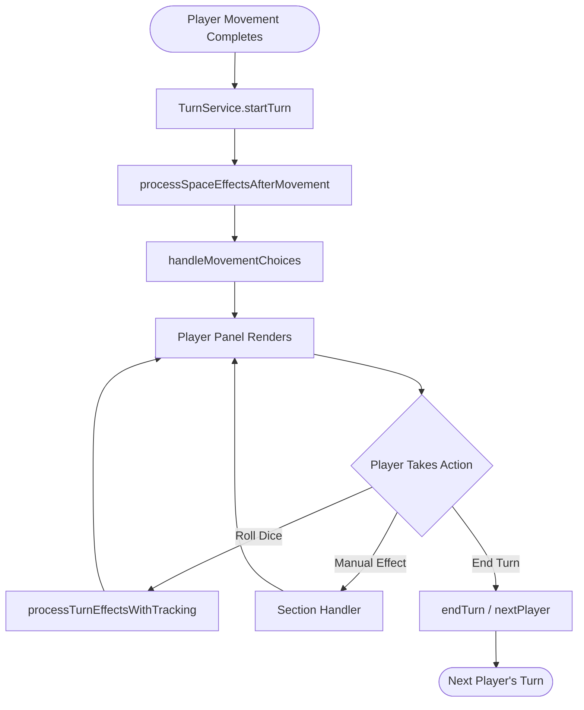

---

## 2. startTurn() Sequence

```mermaid
flowchart TD
    subgraph TURN_START["TurnService.startTurn(playerId)"]
        T1([Movement Complete]) --> T2["1. clearAwaitingChoice()"]
        T2 --> T3["2. isProcessingArrival = true<br/>🔒 UI LOCKED"]
        T3 --> T4["3. startNewExplorationSession()<br/>(logging)"]
        T4 --> T5{"4. isInitialized()?"}
        T5 -->|NO| T5A["markAsInitialized()"]
        T5 -->|YES| T6
        T5A --> T6

        T6["5. processSpaceEffectsAfterMovement()<br/>(playerId, space, visitType)"]
        T6 --> T7["6. savePreSpaceEffectSnapshot()<br/>(if not exists)"]
        T7 --> T8["7. isProcessingArrival = false<br/>🔓 UI UNLOCKED"]
        T8 --> T9["8. handleMovementChoices(playerId)"]
        T9 --> T10([Turn Ready - Panel Renders])
    end

    style T3 fill:#FF6B6B,color:#fff
    style T8 fill:#90EE90
```

### Key Points:
- `processSpaceEffectsAfterMovement` and `handleMovementChoices` run **sequentially** (not parallel)
- UI is locked (`isProcessingArrival = true`) during effect processing
- `handleMovementChoices` only takes `playerId` - it gets `space` and `visitType` from player state

---

## 3. processSpaceEffectsAfterMovement() Details

```mermaid
flowchart TD
    subgraph MAIN["processSpaceEffectsAfterMovement(playerId, spaceName, visitType)"]
        START([Start]) --> GET_PLAYER["1. getPlayer(playerId)"]
        GET_PLAYER --> PLAYER_CHECK{Player exists?}
        PLAYER_CHECK -->|NO| ERROR1[/"Throw Error"/]
        PLAYER_CHECK -->|YES| SNAPSHOT_CHECK

        subgraph SNAPSHOT["2. Snapshot Check (Try Again Logic)"]
            SNAPSHOT_CHECK{"hasPreSpaceEffectSnapshot?"}
            SNAPSHOT_CHECK -->|YES| CALC_MANUAL_ONLY["Calculate manual effects only<br/>updateActionCounts()"]
            CALC_MANUAL_ONLY --> EARLY_RETURN([Return Early])
            SNAPSHOT_CHECK -->|NO| GET_EFFECTS
        end

        subgraph LOAD_DATA["3. Load Space Effects Data"]
            GET_EFFECTS["getSpaceEffects(spaceName, visitType)<br/>from SPACE_EFFECTS.csv"]
            GET_EFFECTS --> FILTER_CONDITIONS["filterSpaceEffectsByCondition()<br/>(scope_le_4M, scope_gt_4M, etc.)"]
            FILTER_CONDITIONS --> GET_SPACE_DATA["getSpaceByName(spaceName)"]
        end

        subgraph DICE_COND["4. Unified Dice Condition Handling"]
            %% As of December 26, 2025: All dice conditions use the unified condition column
            %% See TECHNICAL_DEBT.md for resolution details
            GET_SPACE_DATA --> CHECK_DICE_NEEDED{"ConditionEvaluator.anyEffectNeedsDiceRoll()?"}
            CHECK_DICE_NEEDED -->|NO| FILTER_AUTO
            CHECK_DICE_NEEDED -->|YES| ROLL_ONCE["Roll dice once (1-6)"]
            ROLL_ONCE --> FILTER_WITH_ROLL["filterSpaceEffectsByCondition(effects, player, diceRoll)<br/>Passes dice roll to evaluateCondition()"]
            FILTER_WITH_ROLL --> DICE_CARDS["Dice-conditional effects that passed filter<br/>are processed by EffectEngine"]
            DICE_CARDS --> FILTER_AUTO
        end

        subgraph FILTER_PROCESS["5. Filter & Process Auto Effects"]
            FILTER_AUTO["Filter out:<br/>- trigger_type = 'manual'<br/>- effect_type = 'time'"]
            FILTER_AUTO --> HAS_AUTO{Any auto<br/>effects left?}
            HAS_AUTO -->|NO| NO_EFFECTS(["No auto effects - Return"])
            HAS_AUTO -->|YES| CREATE_EFFECTS
        end

        subgraph EFFECT_ENGINE["7. Generate & Execute Effects"]
            CREATE_EFFECTS["EffectFactory.createEffectsFromSpaceEntry()"]
            CREATE_EFFECTS --> HAS_GENERATED{Effects<br/>generated?}
            HAS_GENERATED -->|NO| NO_PROCESSED(["No processed effects - Return"])
            HAS_GENERATED -->|YES| CREATE_CONTEXT
            CREATE_CONTEXT["Create EffectContext<br/>{source: 'space_arrival',<br/>triggerEvent: 'SPACE_ENTRY'}"]
            CREATE_CONTEXT --> ENGINE_CHECK{EffectEngineService<br/>available?}
            ENGINE_CHECK -->|NO| WARN_NO_ENGINE["Log warning"]
            ENGINE_CHECK -->|YES| PROCESS_EFFECTS
            PROCESS_EFFECTS["effectEngineService.processEffects()"]
            PROCESS_EFFECTS --> RESULT_CHECK{Success?}
            RESULT_CHECK -->|YES| LOG_SUCCESS["Log success"]
            RESULT_CHECK -->|NO| LOG_WARN["Log failures"]
        end

        LOG_SUCCESS --> END_MAIN([End])
        LOG_WARN --> END_MAIN
        WARN_NO_ENGINE --> END_MAIN
    end

    style START fill:#90EE90
    style END_MAIN fill:#90EE90
    style EARLY_RETURN fill:#FFD700
    style NO_EFFECTS fill:#FFD700
    style NO_PROCESSED fill:#FFD700
    style ERROR1 fill:#FF6B6B
```

### Subprocess Summary:
| Step | Subprocess | Purpose |
|------|------------|---------|
| 1 | getPlayer | Validate player exists |
| 2 | Snapshot Check | Skip auto effects if Try Again (preserve state) |
| 3 | Load Data | Get effects from CSV, filter by conditions |
| 4 | Unified Dice | Check if any effects need dice roll, roll once, pass to filter |
| 5 | Filter | Remove manual/time effects (handled elsewhere) |
| 6 | Execute | Run auto effects through EffectEngine |

> **Note:** As of December 26, 2025, dice condition handling was consolidated from 3 separate paths into 1 unified approach. All dice conditions now use the `condition` column in CSV (e.g., `dice_roll_3`) and are evaluated through `filterSpaceEffectsByCondition()` with the optional `diceRoll` parameter.

---

## 4. handleMovementChoices() Details

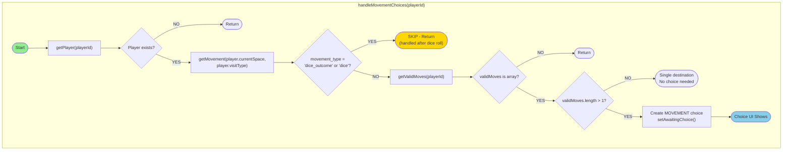

### Three Paths That Create Movement Choices:

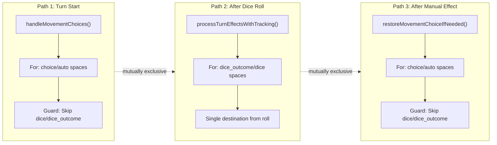

---

## 5. Player Panel Rendering

```mermaid
flowchart TD
    subgraph PANEL["PlayerPanel Component"]
        PP1["Header (avatar, name, location)"]
        PP1 --> PP2{"showMovementTransition?"}
        PP2 -->|YES| PP3["Movement Overlay"]
        PP2 -->|NO| PP4
        PP3 --> PP4{"isMyTurn?"}
        PP4 -->|NO| PP5["Wait Banner"]
        PP4 -->|YES| PP6
        PP5 --> PP6

        PP6["WinConditionBanner"]
        PP6 --> PP7{"currentCard exists?"}
        PP7 -->|YES| PP8["CurrentCardSection"]
        PP7 -->|NO| PP9
        PP8 --> PP9

        PP9["StorySection"]
        PP9 --> PP10["ProjectScopeSection"]
        PP10 --> PP11["FinancesSection"]
        PP11 --> PP12["TimeSection"]
        PP12 --> PP13["CardsSection"]

        PP13 --> PP14{"awaitingChoice?.type<br/>=== 'MOVEMENT'?"}
        PP14 -->|YES| PP15["Movement Choice Buttons"]
        PP14 -->|NO| PP16
        PP15 --> PP16

        PP16["NextStepButton"]
        PP16 --> PP17{"isMyTurn?"}
        PP17 -->|YES| PP18["TryAgainButton"]
        PP17 -->|NO| PP19([End])
        PP18 --> PP19
    end
```

---

## 6. NextStepButton Decision Tree

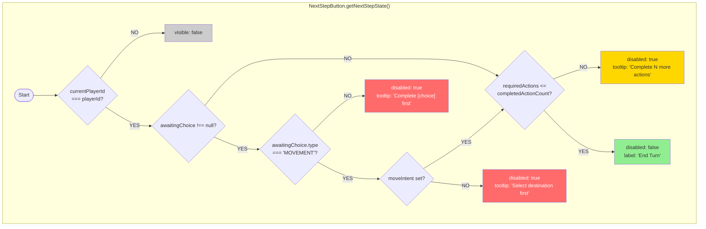

### Text Version:
```
1. Is it my turn? (currentPlayerId === playerId)
   NO  → visible: false (hide button)
   YES → Continue

2. Is there a blocking choice awaiting?
   YES, type === 'MOVEMENT' AND moveIntent set?
        → Continue to check 3
   YES, type === 'MOVEMENT' AND NO moveIntent?
        → disabled: true, tooltip: "Select destination first"
   YES, other type (CARD, DICE...)?
        → disabled: true, tooltip: "Complete [choice type] first"
   NO  → Continue

3. Are all required actions complete?
   requiredActions <= completedActionCount?
   NO  → disabled: true, tooltip: "Complete N more actions"
   YES → disabled: false, label: "End Turn"
```

---

## 7. Movement Choice Display

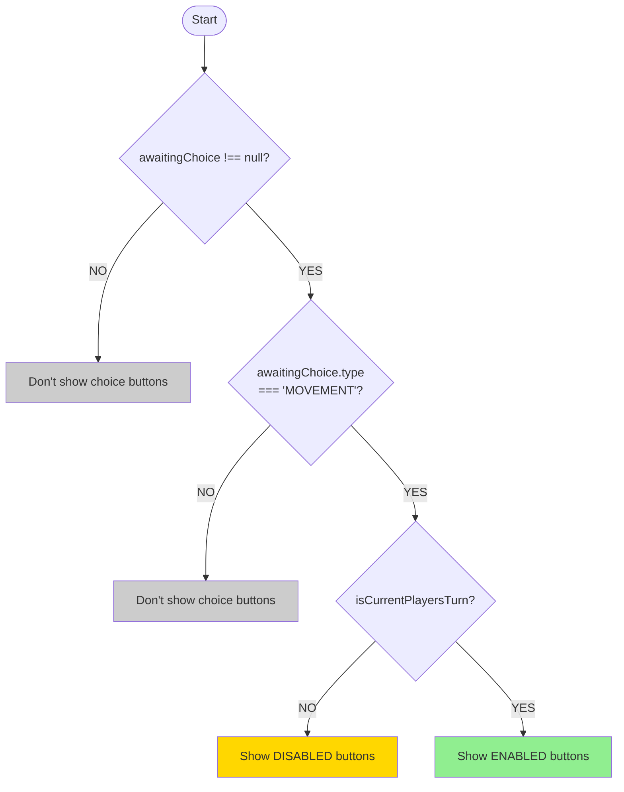

---

## 8. Section Manual Action Buttons

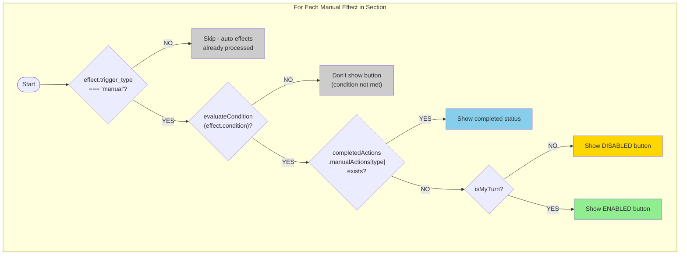

### Condition Examples:
| Condition | Meaning | Used For |
|-----------|---------|----------|
| `scope_le_4m` | Project scope <= $4M | Movement paths, effect filtering |
| `scope_gt_4m` | Project scope > $4M | Movement paths, effect filtering |
| `dice_roll_1` through `dice_roll_6` | Dice rolled specific number | L-card draws, conditional effects |
| `high` | Dice rolled 4, 5, or 6 | Movement, conditional effects |
| `low` | Dice rolled 1, 2, or 3 | Movement, conditional effects |
| `always` | Always applies | Default effects |

> **Note:** Dice conditions (`dice_roll_X`, `high`, `low`) require a dice roll to be passed to `filterSpaceEffectsByCondition()`. The `ConditionEvaluator.anyEffectNeedsDiceRoll()` helper detects when a dice roll is needed.

---

## 9. Dice Roll Button Decision Tree

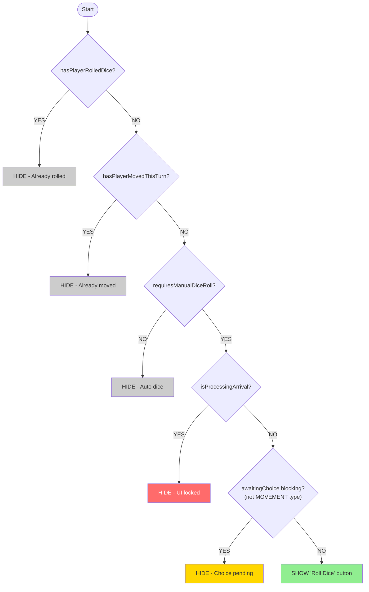

---

## 10. Key State Variables

| Variable | Type | Set When | Cleared When | Controls |
|----------|------|----------|--------------|----------|
| `isProcessingArrival` | boolean | Space entry starts | Effects processed | Locks entire UI |
| `hasPlayerMovedThisTurn` | boolean | After any movement | Turn ends | Hides Roll Dice |
| `hasPlayerRolledDice` | boolean | After Roll Dice click | Turn ends | Hides Roll Dice |
| `awaitingChoice` | Choice \| null | Choice needed | Choice resolved | Blocks End Turn |
| `awaitingChoice.type` | string | With choice | With choice | Determines UI |
| `moveIntent` | string \| null | Destination selected | Movement complete | Enables End Turn |
| `requiredActions` | number | Space effects counted | Turn ends | End Turn enable |
| `completedActionCount` | number | Action completed | Turn ends | End Turn enable |
| `completedActions` | object | Actions tracked | Turn ends | Button states |

### State Flow:
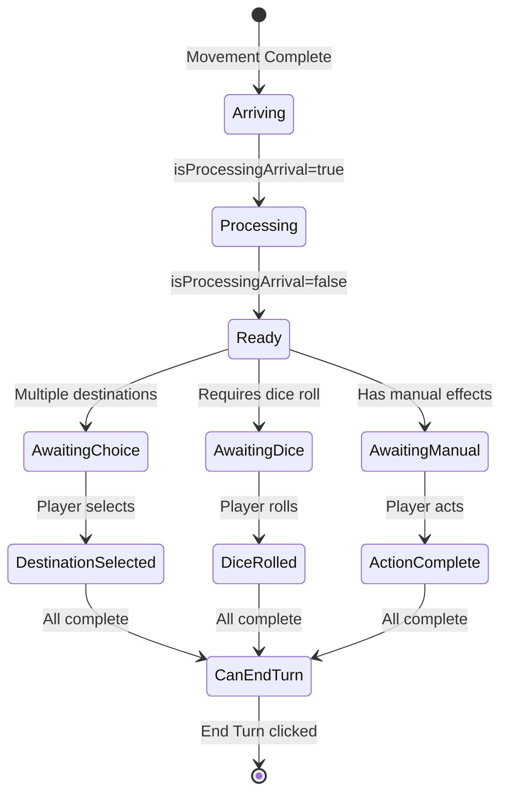

---

## 11. Effect Types Summary

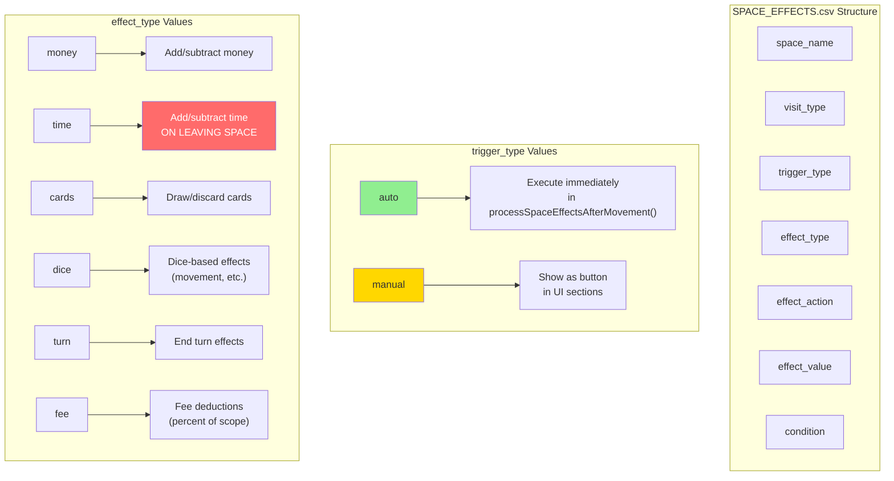

### Important Note on Time Effects:
**Time effects (`effect_type: 'time'`) are NOT processed on space entry!**

They are processed in `processLeavingSpaceEffects()` when the player leaves the space. This represents the time spent working at that location.

---

## Complete Flow Diagram

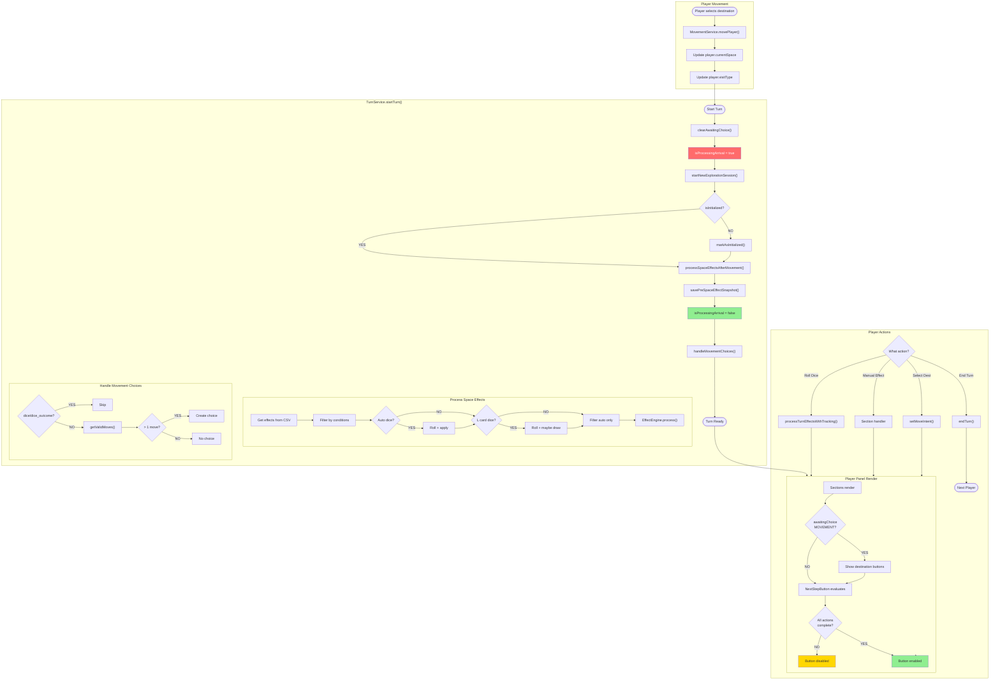

---

## File References

| Component/Service | File Path | Key Functions |
|-------------------|-----------|---------------|
| TurnService | `src/services/TurnService.ts` | `startTurn()`, `processSpaceEffectsAfterMovement()`, `handleMovementChoices()`, `filterSpaceEffectsByCondition()` |
| PlayerPanel | `src/components/player/PlayerPanel.tsx` | Main container component |
| NextStepButton | `src/components/player/NextStepButton.tsx` | `getNextStepState()` |
| ConditionEvaluator | `src/utils/ConditionEvaluator.ts` | `evaluate()`, `isDiceCondition()`, `anyEffectNeedsDiceRoll()`, `isDiceConditionStatic()` |
| EffectFactory | `src/utils/EffectFactory.ts` | `createEffectsFromSpaceEntry()`, `parseSpaceEffect()` |
| EffectEngineService | `src/services/EffectEngineService.ts` | `processEffects()` |
| GameRulesService | `src/services/GameRulesService.ts` | `evaluateCondition()` - handles dice_roll_X conditions |
| StateService | `src/services/StateService.ts` | State management |

---

*Document generated: December 2025*
*Based on codebase analysis of Game Alpha turn processing system*
